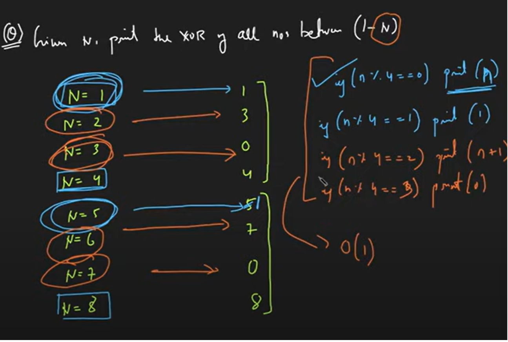
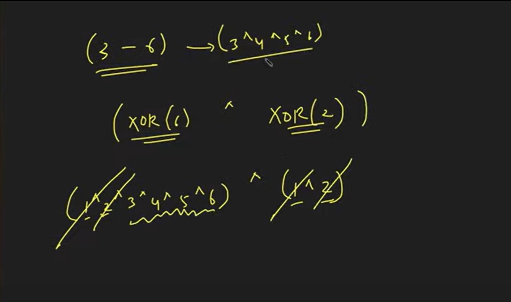

# BITWISE MANIPULAION CODING QUESTIONS
## In an array all numbers occur twice except one. Tell which number occurs only once.
```
#include <bits/stdc++.h>
using namespace std;
int main(){
    int arr[9]={1,1,2,2,3,3,4,4,5};
    int xorred=0;
    for(int i=0;i<9;i++){
        xorred=xorred^arr[i];
    }
    cout<<xorred;
    return 0;
}
```

## Swap two numbers
```
#include <bits/stdc++.h>
using namespace std;
int main(){
    int a=5,b=7;
    a=a^b;
    b=a^b;
    a=a^b;
    cout<<"a= "<<a<<endl<<"b= "<<b;
    return 0;
}
```

## Print xor of all numbers between (1-N). Time complexity=O(1)
```
#include <bits/stdc++.h>
using namespace std;
int main(){
    int n=9;
    if(n%4==0)cout<<n;
    else if(n%4==3)cout<<0;    
    else if(n%4==2)cout<<n+1;
    else if(n%4==1)cout<<1;
    return 0;
}
```

Explanation: There is a pattern being repeated every 4 numbers starting from 1. 


## Given a range, print the xor of all numbers in the given range. Time complexity=O(1)
```
#include <bits/stdc++.h>
using namespace std;
int xorring(int n){
    if(n%4==0)return n;
    else if(n%4==3)return 0;    
    else if(n%4==2)return n+1;
    else if(n%4==1)return 1;
    return -1;
}
int main(){
    int l=3, r=8;
    int res=xorring(l-1)^xorring(r);
    cout<<res;
    return 0;
}
```

Explanation: Find xor of numbers from 1 to (L-1) and 1 to R. Since we dont want 1 to L-1 int the resultant set of Xor(R), xor them, and (L-1) elements will be discarded.

# Properties of bitwise manipulation